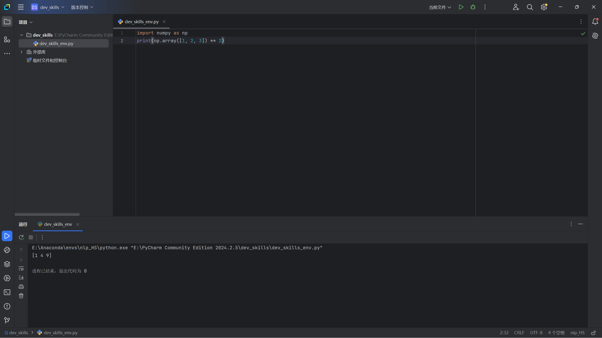

# 牢大的自我介绍


大家好，我是 __牢大__,我的身份是 _前NBA球员_。以下是我的自我介绍：
***
## 基础档案：科比·比恩·布莱恩特·考克斯（Kobe Bean Bryant Cox），出生于美国宾夕法尼亚州费城，美国篮球运动员，司职得分后卫/小前锋。
### 外貌特征：
* 黑人
- 牙齿白
# 我有好朋友：
1. 沙奎尔 奥尼尔
2. 姚明
3.  ~~瓦妮莎~~
### 重要坐标：
住址：[小盒儿](https://baijiahao.baidu.com/s?id=1820103746758157043)

工作单位：[球馆](https://baike.sogou.com/v45185.htm)
### 日常作息表：
| 时间       | 事项 |
|----------|----|
| 4:00 AM  | 起床 |
| 5:00 AM  | 练球 |
| 11:00 PM | 睡觉 |

### 人生信条

> 要得到一切,必须付出一切、征服一切。

------
## 我的专业是人工智能

## 我最喜欢的一段代码
```
import numpy as np
print(np.array([1, 2, 3]) ** 2)
```
其中执行`print(np.array([1, 2, 3]) ** 2)`可输出结果

我最喜欢的环境管理工具是conda

我可以在IDE上使用我建立的虚拟环境

